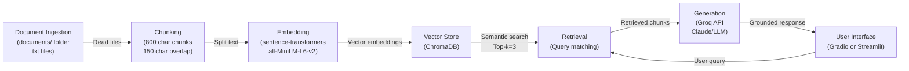

# Project 1 Planning: The Unofficial Guide

> Write this document before you write any pipeline code.
> Your spec and architecture diagram are what you'll use to direct AI tools (Claude, Copilot, etc.) to generate your implementation — the more specific they are, the more useful the generated code will be.
> Update the Retrieval Approach and Chunking Strategy sections if you change your approach during implementation.
> Update this file before starting any stretch features.

---

## Domain

<!-- What domain did you choose? Why is this knowledge valuable and hard to find through official channels? -->
I chose to build a system that helps students find good resturants, mostly locally owned, around Metro State University in Saint Paul. This information is hard to find becuase there is simply no official channel for it, also there is no structured imformation on it in a lot of websites. 
---

## Documents

<!-- List your specific sources: URLs, subreddit names, forum threads, or file descriptions.
     Aim for at least 10 sources that together cover different subtopics or perspectives within your domain. -->

| # | Source | Description | URL or location |
|---|--------|-------------|-----------------|
| 1 | Visit Saint Paul| A saint paul guide website|https://www.visitsaintpaul.com/restaurants/neighborhoods/east-side/ |
| 2 | Visit Saint Paul| A saint paul guide website| https://www.visitsaintpaul.com/restaurants/neighborhoods/lowertown/|
| 3 | East side business association| business association in saint paul | https://esaba.org/directory/|
| 4 | farmers market| imformation about saint paul's farmer's market| https://stpaulfarmersmarket.com/st-paul-farmers-market-vendors/|
| 5 |twincites | Contains imformation about the twincites for eating adventures | https://twincities.eater.com/maps/best-st-paul-restaurants-minnesota|
| 6 | mspmg | Another minnesota guide website| https://mspmag.com/search/location/st-paul-restaurants/|
| 7 | RacketMn|Another minnesota guide website | https://racketmn.com/category/food/|
| 8 | twincites| Contains imformation about the twincites for adventures | https://www.twincities.com/lifestyle/eat/|
| 9 | reddit | a subreddit for information about saint paul| https://www.reddit.com/r/saintpaul/search/%3Fq%3Dfood|
| 10 | swede hollow cafe| A pretty good cafe around saint paul|https://www.swedehollowcafe.com/ |

---

## Chunking Strategy

<!-- How will you split documents into chunks?
     State your chunk size (in tokens or characters), overlap size, and explain why those
     numbers fit the structure of your documents.
     A review-heavy corpus warrants different chunking than a long FAQ. -->

**Chunk size:** 800 characters

**Overlap:** 150 character overlap

**Reasoning:** 800 characters is small enough to capture the a specific restaurant sub-section/ topic. The 150 character overlap ensures that context is preserved incase a chunked information crosses the chunk boundary

---

## Retrieval Approach

<!-- Which embedding model are you using (e.g., all-MiniLM-L6-v2 via sentence-transformers)?
     How many chunks will you retrieve per query (top-k)?
     If you were deploying this for real users and cost wasn't a constraint, what tradeoffs
     would you weigh in choosing a different embedding model — context length, multilingual
     support, accuracy on domain-specific text, latency? -->

**Embedding model:** all-MiniLM-L6-v2

**Top-k:** 3

**Production tradeoff reflection:** all-MiniLM-L6-v2 is fast and efficient

---

## Evaluation Plan

<!-- List your 5 test questions with their expected correct answers.
     Questions should be specific enough that you can judge whether the system's response
     is right or wrong. "What are good dining halls?" is too vague.
     "What do students say about wait times at [dining hall name] during lunch?" is testable. -->

| # | Question | Expected answer |
|---|----------|-----------------|
| 1 | What is the expected tipping etiquette when sitting at the bar vs. getting standard table service? | 15-20% standard for table service , and $1-2 per drink for a bartender.|
| 2 | What are the main ingredients and characteristics of Pho, a popular Vietnamese dish near Metro State? | Slow-cooked broth, fresh rice noodles, customizable proteins (beef, chicken, vegetarian), aromatic herbs (basil, cilantro, lime), and fresh vegetables on the side. |
| 3 | What types of dining establishments are available on the East Side, and what makes them different from each other? | Fine dining (upscale), casual neighborhood restaurants (familiar and unpretentious), authentic ethnic cuisine (Southeast Asian/Hmong, affordable), pub & bar food (comfort food), and street food/quick bites (fast and lower-cost). |
| 4 | What is Banh Mi and what makes it a good meal option for students between classes? | A Vietnamese sandwich with crispy baguette, pickled vegetables, proteins, fresh cilantro, and jalapeno. It's quick, portable, and offers excellent value for quality. |
| 5 | What makes Southeast Asian cuisine in St. Paul authentic and how is it connected to the community? | Recipes passed down through families, ingredients sourced for specific flavor profiles, cooking techniques refined through generations, and restaurants represent first/second/third-generation family businesses continuing family recipes. |

---

## Anticipated Challenges

<!-- What could go wrong? Name at least two specific risks with reasoning.
     Consider: noisy or inconsistent documents, missing source attribution, off-topic
     retrieval, chunks that split key information across boundaries. -->

1.  With 800-character chunks and 150-character overlap, important restaurant details could be split across chunk boundaries if restaurant descriptions exceed the chunk size. This could result in incomplete information being retrieved, e.g., pricing info separated from cuisine type, or restaurant hours separated from location details.

2. If a user asks a question about dining culture or restaurant recommendations that appears similar to multiple chunks (e.g., questions about "best restaurants" might retrieve generic neighborhood descriptions instead of specific restaurant reviews). The all-MiniLM model's 384-dimensional vectors might conflate semantically similar but contextually different information. 

---

## Architecture

<!-- Draw a diagram of your pipeline showing the five stages:
     Document Ingestion → Chunking → Embedding + Vector Store → Retrieval → Generation
     Label each stage with the tool or library you're using.
     You can use ASCII art, a Mermaid diagram, or embed a sketch as an image.
     You'll use this diagram as context when prompting AI tools to implement each stage. -->

---

## AI Tool Plan

<!-- For each part of the pipeline below, describe:
     - Which AI tool you plan to use (Claude, Copilot, ChatGPT, etc.)
     - What you'll give it as input (which sections of this planning.md, which requirements)
     - What you expect it to produce
     - How you'll verify the output matches your spec

     "I'll use AI to help me code" is not a plan.
     "I'll give Claude my Chunking Strategy section and ask it to implement chunk_text()
     with my specified chunk size and overlap" is a plan. -->

**Milestone 3 — Ingestion and chunking:**
Role: You are an emerging AI engineer specialized in building robust Retrieval-Augmented Generation (RAG) pipelines.
Context and Resources:
You have access to a project specification file named planning.md, which outlines the system architecture, evaluation criteria, and a strict chunking strategy.
You have a data directory named documents/ containing ten text documents detailing local restaurant guides, dining culture, and cuisines around Metropolitan State University on the East Side of Saint Paul.
Task Overview:
Your objective is to implement Milestone 3 of the RAG pipeline by creating a standalone, production-grade Python script named chunking_ingestion.py. This script must programmatically load, clean, and chunk the text files according to the strict parameters defined below.
Technical Specifications for Chunking:
Chunking Strategy: Use a recursive character text splitter mechanism to maintain semantic cohesion.
Chunk Size: Exactly 800 characters per chunk
Chunk Overlap: Exactly 150 characters to ensure context, such as parent headers or restaurant names, is preserved across boundaries.

Tokenization Separators: Prioritize splitting text by structural elements in the order of double newlines, single newlines, spaces, and empty strings.
**Milestone 4 — Embedding and retrieval:** 
read planning.md to understand how to construct the next part using this prompt:
Please generate a Python module (or set of functions) that seamlessly integrates into my existing setup, following the exact specifications from my planning.md and the course guidelines below. 1. Current State & Integration Goal  My existing pipeline outputs a list of structured text chunks alongside their metadata (such as the source document name/ID and the chunk's index/position).  Your goal is to accept these existing chunks, embed them, commit them to a local vector store, and create a functional semantic retrieval function. 2. Technical Specifications  Embedding Model: Local all-MiniLM-L6-v2 via the sentence-transformers library (do not use cloud APIs).  Vector Database: Local ChromaDB (using the current persistent client syntax).  Retrieval Scope: Top-k retrieval set to return the top 4-5 most relevant chunks per query.  Metadata: Strict preservation of the source document filename/ID and relative position for down-stream source attribution. 3. Required Functions to Implement Please provide clean, modular Python code for: 1. Vector Store Initialization: A function to initialize the local Chroma persistent client and get/create a collection. 2. Chunk Ingestion (add_chunks_to_vector_store): A function that takes my pipeline's output chunks and their corresponding source metadata, embeds them using all-MiniLM-L6-v2, and upserts them into ChromaDB. 3. Semantic Search (retrieve_relevant_chunks): A function that takes a plain-language query string, queries the vector store, and returns a structured list of matches. Each match must explicitly return:  The chunk text  The source metadata (document name and position)  The distance/similarity score (for auditing quality)
**Milestone 5 — Generation and interface:**
read planning.md to understand how to construct the next part using this prompt:
Your Task: Build Grounded Generation + Query Interface
Generate a complete Python module called query_interface.py that:
Enforces grounding at the system level (not just LLM suggestions)
Guarantees source attribution programmatically
Integrates ChromaDB retrieval with Groq LLM
Provides a Gradio web UI for end-to-end testing
Can be tested against the 5 evaluation queries in planning.md
Requirements
Grounding Architecture
Your grounding strategy must satisfy:
Retrieval-Only Context: The LLM receives ONLY the top-3 retrieved chunks as context. No general knowledge injection.
System Prompt Enforcement: The system prompt MUST explicitly forbid generation outside the retrieved context — not merely suggest it.
Reject Pattern: If the retrieved chunks do not answer the question, the LLM must say exactly: "I don't have enough information on that based on the restaurant guides available."
Test Case: Ask the system a question it cannot answer (e.g., "What sushi restaurants exist in downtown Anchorage?"). It should refuse, not hallucinate.
Example of STRONG grounding (answer is traceable to retrieved text):
"According to the Hmong Village Shopping Center guide, you can find authentic Hmong cuisine at affordable prices. The documents specifically mention family-run restaurants with recipes passed down through generations."
Source: hmong_village_shopping_center.txt
Example of WEAK grounding (sounds good but not from docs):
"There are several great Hmong restaurants in Saint Paul. These establishments typically offer traditional cooking techniques and family recipes. Many have been operating for decades and maintain high quality standards."
[No source cited]
This is a grounding failure even if factually correct.
